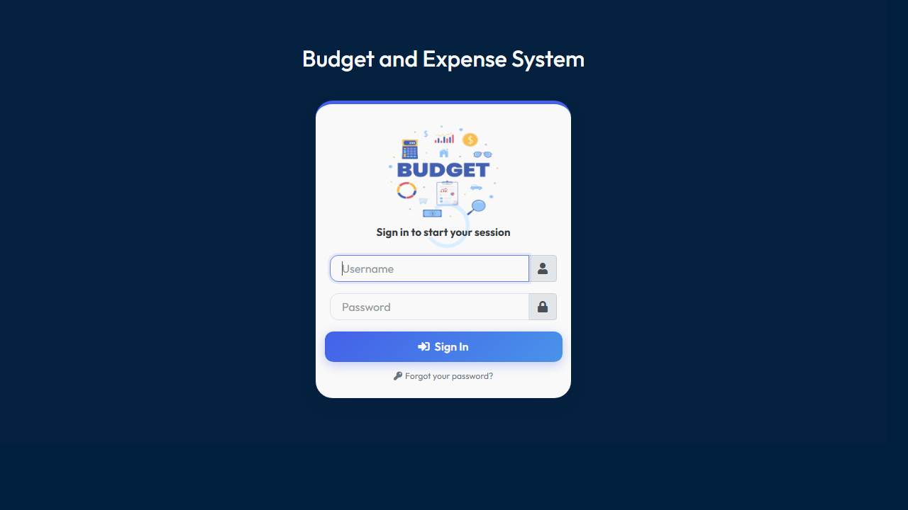
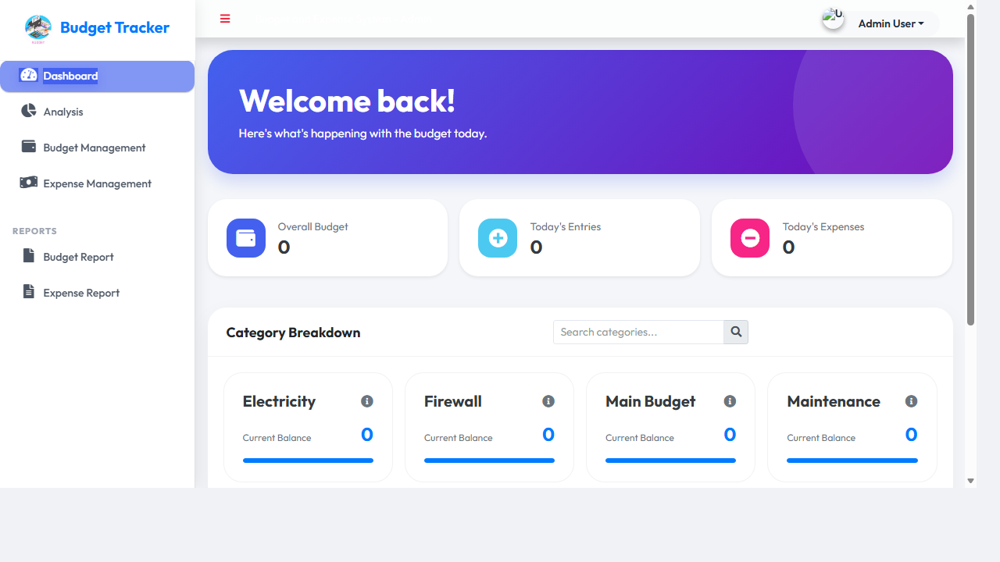
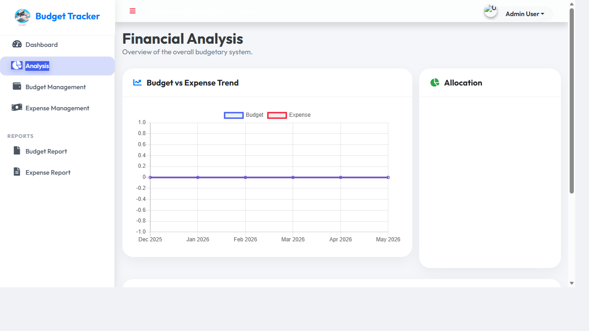
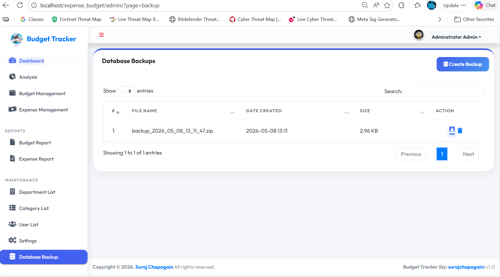
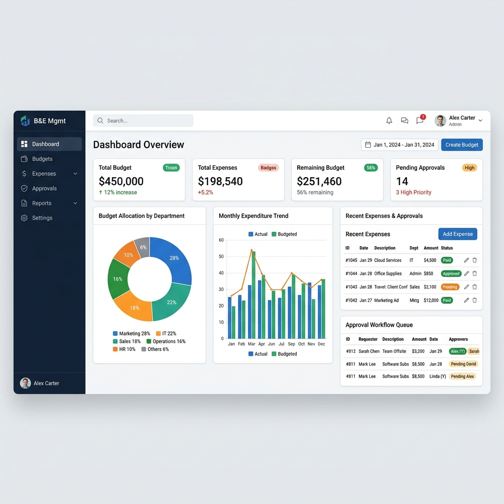
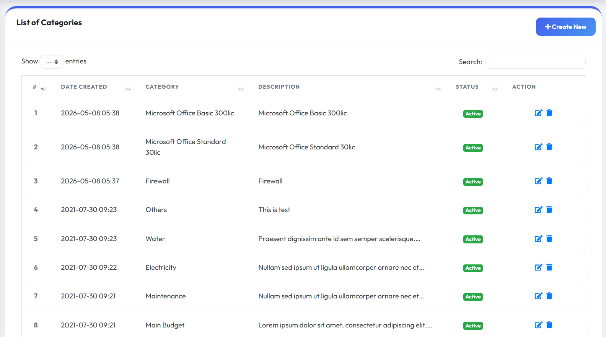
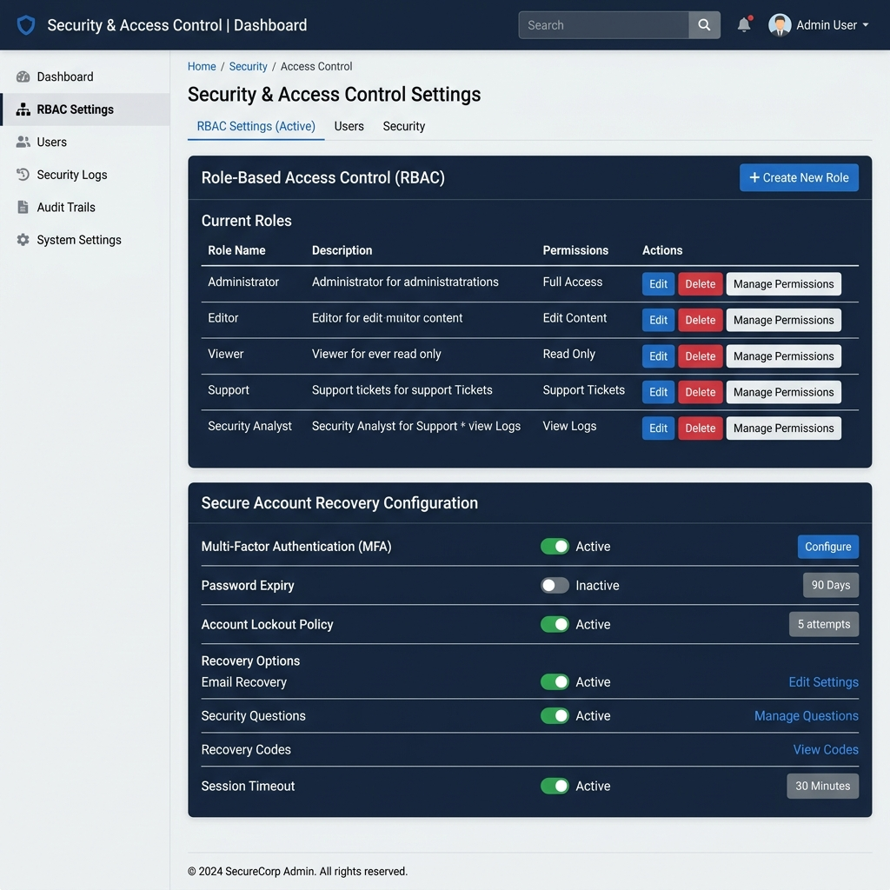

# Expense and Budget Management System

## Overview
This is a comprehensive web-based application designed to manage corporate expenses and budgeting. Built on a standard LAMP/WAMP stack (PHP, MySQL), it provides role-based access control and detailed analytics. The system aims to streamline financial operations and improve organizational transparency.

## Key Features

### 1. Dashboard & Analytics
Get real-time visual representations of budget utilization and expenditure breakdowns. The dashboard provides an at-a-glance overview of the financial health of the organization, helping decision-makers track ongoing expenses against allocated budgets.

### 2. Detailed Analysis & Reporting
The system offers in-depth analysis tools. Departmental users can view data restricted to their own units, while administrators have full organizational visibility.
- Export expense data to CSV/Excel for auditing.
- Dynamic charts and metrics.

### 3. Database Backup & Restore
A comprehensive built-in backup management tool available to administrators.
- 1-click database SQL dump.
- Automatic compression into `.zip` archives.
- Graceful fallbacks for different server environments (PowerShell zip, raw `.sql`).
- Download and delete backups directly from the administrative interface.

### 4. Budget & Expense Management
The core system for departments to request and manage their financial resources. It features:
- **Budget Allocation**: Set and track departmental budgets.
- **Expenditure Tracking**: Monitor ongoing expenses against allocated budgets in real-time.
- **Approval Workflows**: Ensure all expenses are vetted and approved by authorized personnel.

### 5. Category Management
Organize product and expense categories through a highly searchable and user-friendly interface. 
- **Real-time Autocomplete**: Quickly find existing categories to prevent duplication.
- **Robust Validation**: Prevents adding or editing categories with duplicate descriptions.
- **Persistent Pagination**: Navigate through large lists of categories effortlessly.

### 6. Security and Access Control
- **Role-Based Access Control (RBAC)**: Strict segregation of duties. Standard users are restricted to their own department's data, while administrators have full organizational visibility.
- **Secure Account Recovery**: A reliable password reset flow complete with AJAX functionality and corporate SMTP-integrated email notifications to ensure secure access recovery.

## Tech Stack
- **Backend**: PHP (v8.x recommended)
- **Database**: MySQL / MariaDB
- **Frontend**: HTML5, CSS3, JavaScript (Bootstrap 4, Chart.js for analytics, jQuery)
- **Environment**: Compatible with XAMPP, WAMP, or standard Apache/PHP servers

## Project Structure
- `/admin`: Administrative interface and core application modules (Analysis, Dashboard, Budget Management, etc.)
- `/assets`: Static frontend assets (CSS, JS, images, including UI screenshots)
- `/classes`: PHP classes for application logic and database interactions
- `/database`: Contains database SQL dumps or related structures
- `/plugins`: Third-party plugins and libraries
- `/uploads`: Directory for file uploads
- `config.php`: Database and application configuration settings

## Setup and Installation
1. Place the project files into your web server's document root (e.g., `C:\xampp\htdocs\expense_budget`).
2. Create a MySQL database for the project (e.g., `expense_budget_db`).
3. Import the required SQL schema (`database/expense_budget_db.sql`) into the database.
4. Update the database credentials in `config.php`.
5. Access the application via your web browser (e.g., `http://localhost/expense_budget/`).
6. Default Admin Credentials: Check the database for the default admin user.
